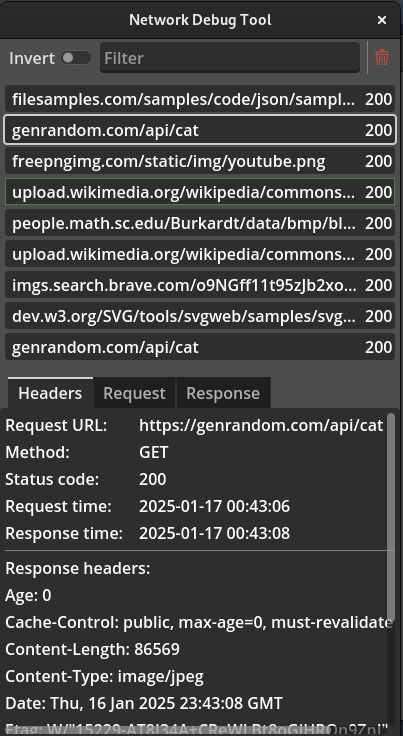
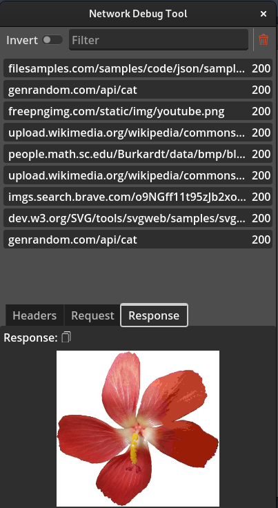

# Network Debug Tool

Created for Godot 4.x

Tool for debugging (previewing) all Network communication going through Godot application

I created this plugin, because every time I wanted to see details of the HTTP requests I made from my Godot application, I did it by printing the request/response details to the console. With many requests this quickly gets very noisy and difficult to actually find important information. Plus the amount of noise it makes, it's mutch harder to debug other parts of the application also using print statements.

This tool is highly inspired by the browser's Developer Tools, specifically Network tab of the Inspector.

## Behavior

Requests are previewed in the new window, after running the project. There is a list of requests that has been made until now. New reuests will pop on the list, after are made. When the request row is clicked, a details section appears at the bottom, allowing to read all the neccessary informations, as well as copy them to the clipboard.

If request downloaded an image, the preview of that image is displayed in the Response details tab.




## Instalation

To implement this plugin in your Godot application, download the files and copy `project/addons/NetworkDebugTool` folder into your project `res://addons` folder.

Then go to `Project -> ProjectSettings -> Plugins` and select `Enabled` near the `NetworDebugTool` plugin name

Then you need to specify action for opening the GUI. Go to `Project -> ProjectSettings -> Input Map` and add new action called `ndt_show`. This MUST be named that way!
Click a plus button next to the newly created action, to Add Event, and make a shortcut that will later trigger GUI showing. 
I prefer to choose Ctrl + Shift + I here, just as it is for browser Developer Tools, but this combination can be whatever fits best in your case.

You can also call `NetworkDebugTool.pop_window()` method to show the GUI by code, i.e. automatically at the application start.

### Making requests

Requests made via Godot's built in `HTTPRequest` node will not be registered. Instead one should use `NDT_RequestDetails` node class, provided by the plugin. This class works as wrapper for the regular HTTPRequest class, but it does register all of the neccessary details and notifies NetworkDebugTool singleton about requests made.

So instead of old way of making requests:

```python
var req: HTTPRequest = HTTPRequest.new()
add_child(req)
req.request("https://genrandom.com/api/cat")
```

Now use the new class:

```python
var req: NDT_RequestDetails = NDT_RequestDetails.new()
add_child(req)
req.request("https://genrandom.com/api/cat")
```

## Disclaimer

This plugin is strill under development. It's NOT production safe and should be used with caution! If you find any problems with it or things to improve, I'd love to see your thoughts in the Github issues section.

Any feedback and contributions are welcome.
